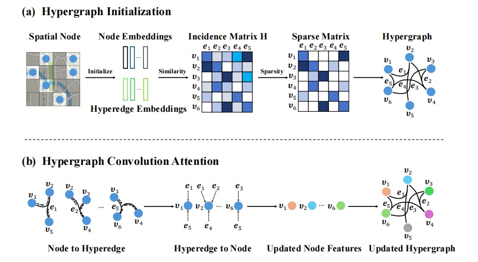
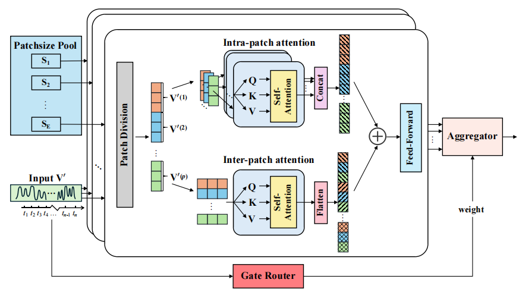

## (KDD 2026) SHADE: Anomaly-Aware Matrix Completion via Multi-Scale Temporal Modeling and Adaptive Hypergraphs in Sparse Crowdsensing

This code is a PyTorch implementation of our KDD'2026 paper "SHADE: Anomaly-Aware Matrix Completion via Multi-Scale Temporal Modeling and Adaptive Hypergraphs in Sparse Crowdsensing".


## Introduction
 SHADE, a unified framework for anomaly detection and data completion in sparse Mobile CrowdSensing (MCS). It integrates adaptive hypergraph modeling to capture high‑order spatial dependencies from sporadic observations, and a multi-scale temporal encoder to distinguish true anomalies from sparsity‑induced variations. Furthermore, a detect‑mask‑complete strategy prevents detected anomalies from corrupting the subsequent completion process, leading to significantly improved data recovery accuracy.


The important components of SHADE include: 

(1) Adaptive Spatial Hypergraph Module



(2) Multi-Scale Temporal Mixture of Experts



## Installation
Given a python environment (**note**: this project is fully tested under python 3.8), install the dependencies with the following command::
```
pip install -r requirements.txt
```

## Datasets
You can access the datasets and the anomaly generator from [OneDrive](https://1drv.ms/u/c/a4911a961d77d2bd/IQBlSlXDpA_FToE35pmNBe95AaYyVSiqZo4xeSHRaygyP0s?e=epbqKc), then you can freely change the type and scale of the anomalies according to your requirements.

If you want to learn more about the definition and generation principle of anomalies, please refer to the paper [Revisiting Time Series Outlier Detection: Definitions and Benchmarks](https://openreview.net/pdf?id=r8IvOsnHchr).

## Quick Demos
1. Download datasets and place them under ./dataset
2. Generate anomalies using ./dataset_generator/main.py
2. Run each script in scripts/, for example
```
bash scripts/anomaly_detection/NO2/SHADE.sh
```


